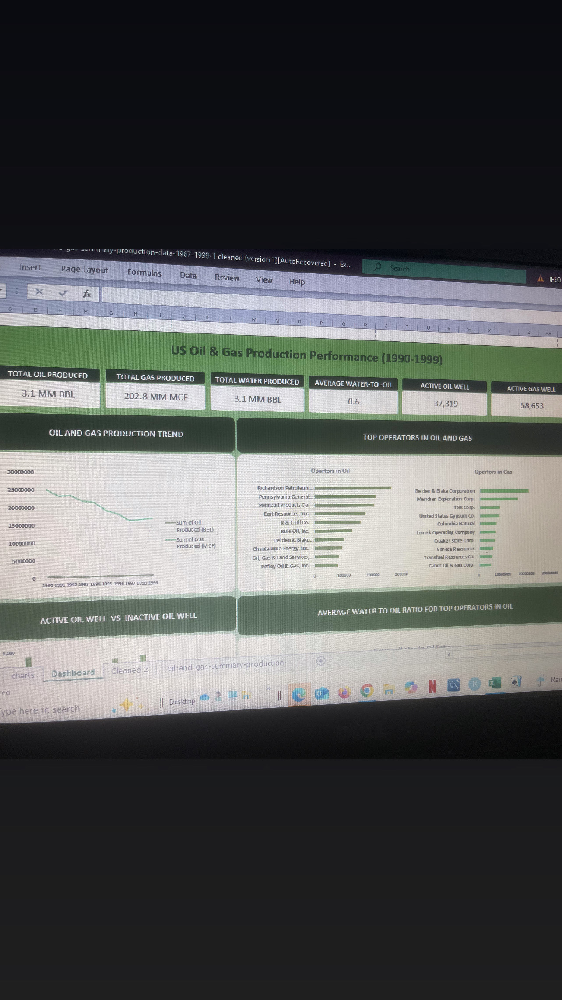
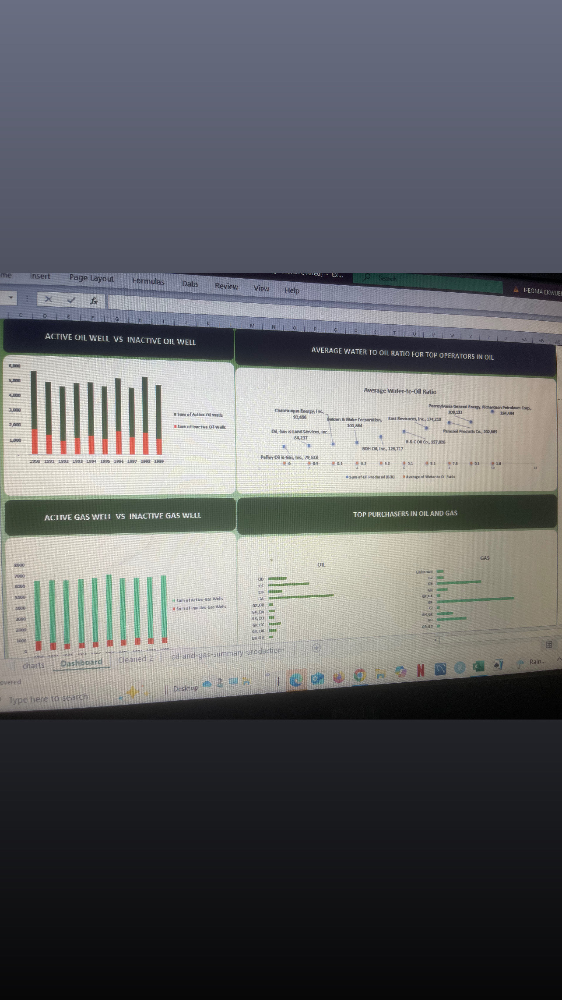

#  US oil and Gas Production Dashboard (1990-1991)

## Overview
This project showcases a dashboard created as a part of my learning process using a historical US oil and gas production data.
The analysis focuses on a 10 year period (1990-1999) to examine production trends and patterns over time.

## Objectives
- Analyze oil and gas production trend over a 10 year period
- Compare oil and gas production patterns across the selected years
- Analyze active oil wells and inactive oil wells, active gas well and inactive gas well.
- Answer key business and analytical questions through visual insights
- KPI placement 
- Visual clarity for production data

## Dataset
- Source: Kaggle
  
## Tools Used
Excel

## Lessons Learnt
- Importance of documenting my work early
- Value of keeping dataset alongside dashboard

## Dashboard Preview

## Notes
This project was created earlier in my learning journey and focuses on trend analysis and dashboard design.
